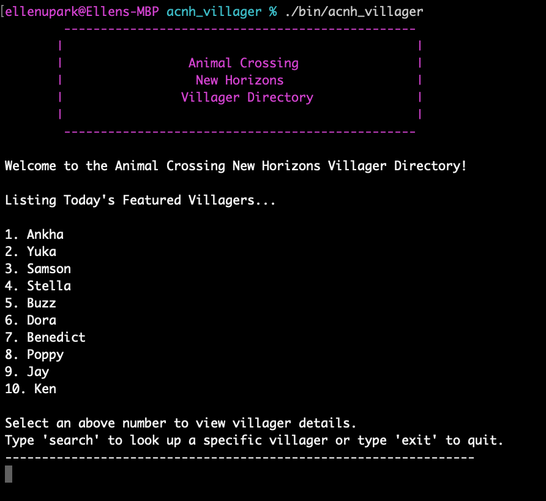
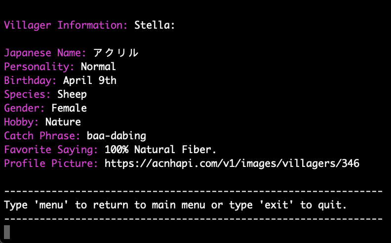

# AcnhVillager

## Description

ACNH Villager is a Command Line Interface (CLI) that provides detailed information on villagers from Animal Crossing New Horizons. It is built with object oriented Ruby and utilizes data from an outside API.

## Usage

Navigate to the root directory. Execute the bin file `./bin/acnh_villager`. A list of villagers will be displayed. There is also the option to search for a specific villager.  



Select a villager by number to view detailed information.



## Installation

Add this line to your application's Gemfile:

```ruby
gem 'acnh_villager'
```

And then execute:

    $ bundle install

Or install it yourself as:

    $ gem install acnh_villager

## Development

After checking out the repo, run `bin/setup` to install dependencies. You can also run `bin/console` for an interactive prompt that will allow you to experiment.

To install this gem onto your local machine, run `bundle exec rake install`. To release a new version, update the version number in `version.rb`, and then run `bundle exec rake release`, which will create a git tag for the version, push git commits and tags, and push the `.gem` file to [rubygems.org](https://rubygems.org).

## Contributing

Bug reports and pull requests are welcome on GitHub at https://github.com/ellenupark/acnh_villager.


## License

The gem is available as open source under the terms of the [MIT License](https://opensource.org/licenses/MIT).

## Further Information
[Personal Website](https://ellenupark.github.io) | [LinkedIn](http://www.linkedin.com/in/ellenupark) | [Blog](https://ellen-park.medium.com/)